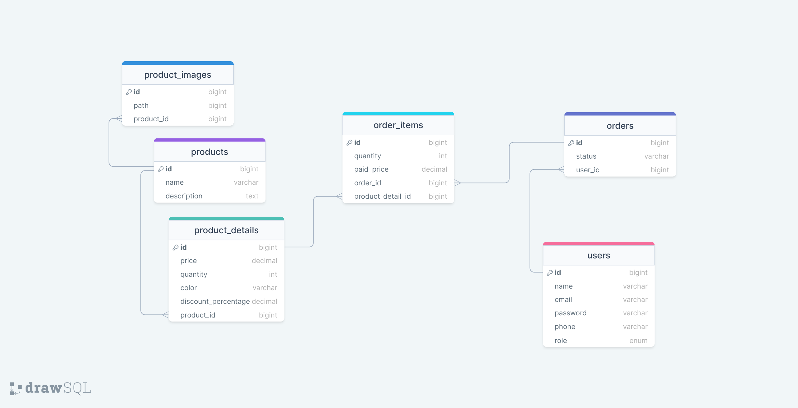

# Aquadic E-commerce API Task

Welcome to the Aquadic E-Commerce API, a simulation of essential e-commerce functionalities, including authentication, order placement, and email notifications on ordering. This app is built using the Laravel framework version 10.

## Getting Started

**Note:** Before you begin, make sure you have the following prerequisites installed on your system:

-   [PHP](https://www.php.net/) (>= 7.4)
-   [Composer](https://getcomposer.org/)
-   [MySQL](https://www.mysql.com/)

These tools are essential for setting up and running the application. If you don't have them installed, you can download and install them from the provided links.

Once the prerequisites are in place, follow the installation steps below to set up the project locally.

1. Clone the repository:

    ```bash
    git clone https://github.com/edriso/aquadic-ecommerce-api-task.git
    ```

2. Navigate to the project directory:

    ```bash
    cd aquadic-ecommerce-api-task
    ```

3. Install PHP dependencies using Composer:

    ```bash
    composer install
    ```

4. Copy the example environment file

    ```bash
    cp .env.example .env
    ```

5. Configure your mail service provider environment variables:

    Open the `.env` file in a text editor and locate the mail-related configuration section. Update the following environment variables with your mail service provider's credentials:

    ```dotenv
    MAIL_MAILER=smtp
    MAIL_HOST=your-mail-host
    MAIL_PORT=your-mail-port
    MAIL_USERNAME=your-mail-username
    MAIL_PASSWORD=your-mail-password
    MAIL_ENCRYPTION=your-mail-encryption
    MAIL_FROM_ADDRESS=your-email@example.com
    MAIL_FROM_NAME="${APP_NAME}"
    ```

    Ensure that you replace placeholders like `your-mail-host`, `your-mail-port`, `your-mail-username`, `your-mail-password`, and `your-mail-encryption` with the actual values provided by your mail service provider.

    If you are using a testing service like Mailtrap during development, replace the values accordingly. For production, update these settings based on the mail service you are using.

    Save the changes to the `.env` file.

6. Run database migrations to set up the necessary tables:

    ```bash
    php artisan migrate
    ```

7. Start the Laravel development server:

    ```bash
    php artisan serve
    ```

8. In a separate terminal, run the following command to start the queue worker (necessary for email notifications to clients when placing an order):

    ```bash
    php artisan queue:work
    ```

    This command ensures that the notification tasks, including sending emails to affected clients, are handled in the background, providing a seamless and responsive experience for clients. Keep the queue worker running to continually process queued jobs and deliver timely notifications.

### Postman

1. **Database Setup:**

    Run database migrations and seed data to populate the database:

    ```bash
    php artisan migrate --seed
    ```

2. **API Testing:**

    Open [Postman](https://www.postman.com/), and import the provided collection (located in `readme-files/aquadic-ecommerce-api.postman_collection.json`). The collection includes a set of pre-configured API endpoints for testing various features of the e-commerce application. Utilize this tool to simulate requests, inspect responses, and ensure the proper functioning of your API.

    [Download Postman Collection](readme-files/aquadic-ecommerce-api.postman_collection.json)

3. **Authentication:**

    - **Login or Register:** Start with the `Login` or `Register` request from the collection. Copy the token from the response.

    - **Bearer Token:** Paste the copied token in the `Authorization` header as a bearer token for subsequent requests.

### Database Schema


